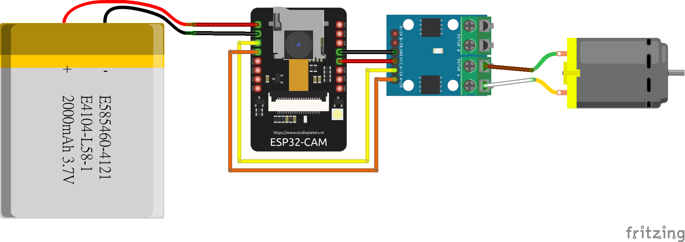
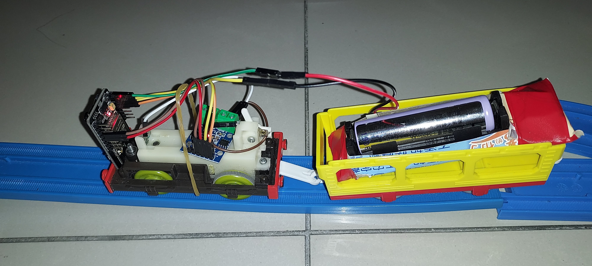
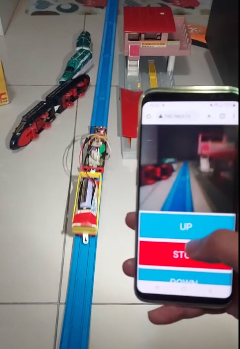

# Modification of TAKARA TOMY PLARAIL for Remote Control

# Circuit Diagram

# Materials  
* ESP32CAM * 1  
* Battery 3.7v to 5v * 1  
* L9110s * 1  
* plarail * 1

# Installation:  
1. Battery 5v -> ESP32CAM 5V  
2. Battery GND -> ESP32CAM GND  
3. ESP32CAM 3.3v -> L9110s VCC  
4. ESP32CAM GND -> L9110s GND  
5. ESP32CAM GPIO 12 -> L9110s A-1A  
6. ESP32CAM GPIO 13 -> L9110s A-1B  
7. L9110s A-A -> plarail +
8. L9110s A-B -> plarail -

# Note:  
1. The 3.7v battery needs to be boosted to 5v to ensure the stability of the ESP32CAM.
2. When the 3.3v output is connected to the L9110s and the `digitalWrite()` is switched, there may be noise, so connecting VCC to the battery is more stable.

# Demo

# Video

<a src="https://youtube.com/shorts/aUUs-A2DXvQ?feature=share">Youtube link</a>  
